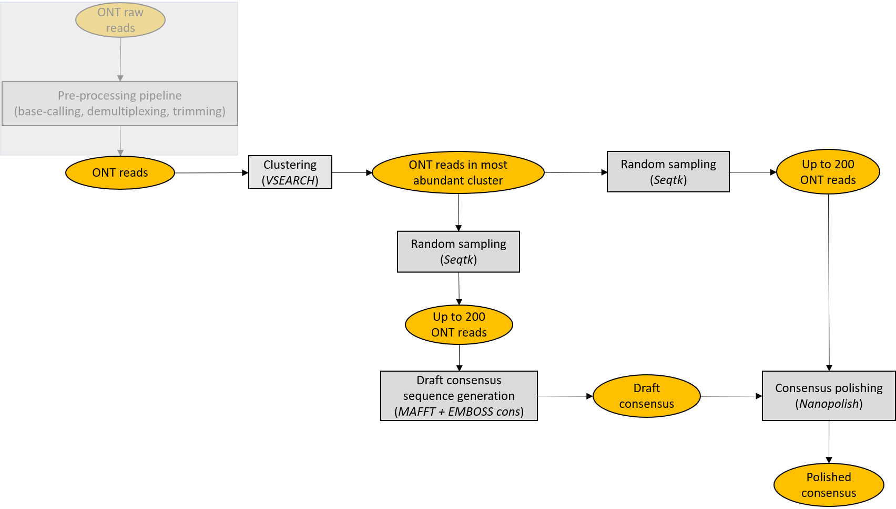

# ONTrack

**ONTrack** is a rapid and accurate MinION-based pipeline for tracking species biodiversity on site; starting from MinION sequencing reads, the ONTrack pipeline is able to provide accurate consensus sequences in ~15 minutes per sample on a standard laptop. Moreover, a preprocessing pipeline is provided, so to make the whole bioinformatic analysis from raw fast5 files to consensus sequences straightforward and simple.

<p align="center">
  
</p>

## Getting started

**Prerequisites**

* Miniconda3.
Tested with conda 4.6.11.
```which conda``` should return the path to the executable.
If you don't have Miniconda3 installed, you could download and install it with:
```
wget https://repo.anaconda.com/miniconda/Miniconda3-latest-Linux-x86_64.sh
chmod 755 Miniconda3-latest-Linux-x86_64.sh
./Miniconda3-latest-Linux-x86_64.sh
```

Then, after completing _ONTrack_ installation, set the _MINICONDA_DIR_ variable in **config_MinION_mobile_lab.R** to the full path to miniconda3 directory.

* Guppy, the software for basecalling and demultiplexing provided by ONT. Tested with Guppy v2.3.7.
If you don't have [Guppy](https://community.nanoporetech.com/downloads) installed, choose an appropriate version and install it.
For example, if you want to download Guppy v2.3.7 for Linux 64 bit, you could download and unpack the archive with:
```
wget https://mirror.oxfordnanoportal.com/software/analysis/ont-guppy-cpu_2.3.7_linux64.tar.gz
tar -xf ont-guppy-cpu_2.3.7_linux64.tar.gz
```
A directory _ont-guppy-cpu_ should have been created in your current directory.
Then, after completing _ONTrack_ installation, set the _BASECALLER_DIR_ variable in **config_MinION_mobile_lab.R** to the full path to _ont-guppy-cpu_ directory.

* R with package Biostrings installed and Rscript available in your path.
Tested with R version 3.2.2 (2015-08-14) and Biostrings version 2.38.4.
```which R``` and ```which Rscript``` should return the path to the executables.

If you don't have R already installed, you could download and install it with:
```
conda install -c r r
```
Biostrings package could be installed with:
```
R
source("http://bioconductor.org/biocLite.R")
biocLite("Biostrings")
```

* NCBI nt database (optional, in case you want to perform a local Blast analysis of your consensus sequences).

For downloading the database (~65 GB):

```
mkdir NCBI_nt_db
cd NCBI_nt_db
echo `date +%Y-%m-%d` > download_date.txt
wget ftp://ftp.ncbi.nlm.nih.gov/blast/db/nt*
targz_files=$(find . | grep \.tar\.gz$ | sed 's/\.\///g')
for f in $targz_files; do tar -xzvf $f; done
rm $targz_files
```

Then, after completing the _ONTrack_ installation, set the _NTDB_ variable in **config_MinION_mobile_lab.R** to the full path to NCBI_nt_db/nt

**Installation**

```
git clone https://github.com/MaestSi/ONTrack.git
cd ONTrack
chmod 755 *
./install.sh
```

A conda environment named _ONTrack_env_ is created, where blast, emboss, vsearch, seqtk, mafft, porechop, minimap2, samtools, nanopolish and pycoQC are installed.
Then, you can open the **config_MinION_mobile_lab.R** file with a text editor and set the variables _PIPELINE_DIR_ and _MINICONDA_DIR_ to the value suggested by the installation step.

## Overview

<p align="center">
  
</p>

## Usage

The ONTrack pipeline can be applied either starting from raw fast5 files, or from already basecalled and demultiplexed sequences.
In both cases, the first step of the pipeline requires you to open the **config_MinION_mobile_lab.R** file with a text editor and to modify it according to the features of your sequencing experiment and your preferences.
If you have already basecalled and demultiplexed your sequences, you can run the pipeline using the **ONTrack.R** script.
Otherwise, you can run the pipeline using the **launch_MinION_mobile_lab.sh** script.

**ONTrack.R**

Usage: Rscript ONTrack.R \<home_dir\> \<fast5_dir\> \<sequencing_summary.txt\>

Note: Activate the virtual environment with ```source activate ONTrack_env``` before running. The script is run by **MinION_mobile_lab.R**, but can be also run as a main script if you have already basecalled and demultiplexed your sequences. If less than 200 reads are available after contaminants removal, the sample is skipped.

Inputs:
* \<home_dir\>: directory containing fastq and fasta files for each sample
* \<fast5_dir\>: directory containing raw fast5 files for nanopolish polishing, optional
* \<sequencing_summary.txt\>: sequencing summary file generated during base-calling, used to speed-up polishing, optional

Outputs (saved in <home_dir>):
* \<"sample_name".contigs.fasta\>: polished consensus sequence in fasta format
* \<"sample_name".blastn.txt\>: blast analysis of consensus sequence against NCBI nt database (if _doBlast_ variable is set to 1 in **config_MinION_mobile_lab.R**)
* \<"sample_name"\>: directory including intermediate files

**launch_MinION_mobile_lab.sh**

Usage:
launch_MinION_mobile_lab.sh \<fast5_dir\>

Note: modify **config_MinION_mobile_lab.R** before running; the script runs the full pipeline from raw fast5 files to consensus sequences.

Input
* \<fast5_dir\>: directory containing raw fast5 files

Outputs (saved in \<fast5_dir\>_analysis/analysis):
* \<"sample_name".contigs.fasta\>: polished consensus sequence in fasta format
* \<"sample_name".blastn.txt\>: blast analysis of consensus sequence against NCBI nt database (if _do_Blast_ is set to 1 in **config_MinION_mobile_lab.R**)
* \<"sample_name"\>: directory including intermediate files

Outputs (saved in \<fast5_dir\>_analysis/qc):
* Read length distributions and pycoQC report

Outputs (saved in \<fast5_dir\>_analysis/basecalling):
* Temporary files for basecalling

Outputs (saved in \<fast5_dir\>_analysis/preprocessing):
* Temporary files for demultiplexing, filtering based on read length and adapters trimming

## Auxiliary scripts

In the following, auxiliary scripts run either by **ONTrack.R** or by **launch_MinION_mobile_lab.sh** are listed. These scripts should not be called directly.

**MinION_mobile_lab.R**

Note: script run by _launch_MinION_mobile_lab.sh_.

**config_MinION_mobile_lab.R**

Note: configuration script, must be modified before running _launch_MinION_mobile_lab.sh_ or _ONTrack.R_.

**subsample_fast5.sh**

Note: script run by _MinION_mobile_lab.R_ if _do_subsampling_flag_ variable is set to 1 in _config_MinION_mobile_lab.R_.

**remove_long_short.pl**

Note: script run by _MinION_mobile_lab.R_ for removing reads shorter than mean - 2\*sd and longer than mean + 2\*sd.

**DecONT.sh**

Note: script run by _ONTrack.R_ for clustering reads at 70% identity and keeping only reads in the most abundant cluster.

## Checking scripts

**Sanger_check.sh**

Usage: Sanger_check.sh \<consensus dir\> \<sanger dir\>

Note: set _BLASTN_ variable to blastn executable inside the script; sample name should contain the sample id (e.g. BC01)

Inputs:
* \<consensus dir\>: directory containing files "sample_name".contigs.fasta obtained with the _ONTrack_ pipeline
* \<sanger dir\>: directory containing fasta files reference_"sample_name".fasta obtained with Sanger sequencing

Output (saved in \<contigs dir\>):
* <results_"sample_name".txt>: file including alignment of MinION consensus sequence to corresponding Sanger sequence
* \<Sanger_check_report.txt\>: file including overall alignment statistics and number of uncertain nucleotides in Sanger sequences

**Mapping_rate_test.sh**

Usage: Mapping_rate_test.sh \<reads\> \<draft reads\> \<consensus sequence\>

Note: set _MINIMAP2_ and _SAMTOOLS_ variables to minimap2 and samtools executables inside the script

Inputs:
* \<reads\>: MinION reads in fastq or fasta format
* \<draft reads\>: MinION reads in fasta format used for creating draft consensus sequence
* \<consensus sequence\>: polished consensus sequence in fasta format

Output (saved in current directory):
* \<"sample_name"_report_mapping_rate.txt\>: mapping rate statistics

**Calculate_error_rate.sh**

Usage: Calculate_error_rate.sh \<reads\> \<reference\>

Note: set _MINIMAP2_ and _SAMTOOLS_ variables to minimap2 and samtools executables inside the script

Inputs:
* \<reads\>:  MinION reads in fastq or fasta format
* \<reference\>: Sanger sequence corresponding to MinION reads

Outputs:
* \<"sample_name"_error_rate_stats.txt\>: error rate statistics

## Citation

If this tool is useful for your work, please consider citing our [preprint](http://example.com/).

## Side notes

As a real-life _Pokédex_, the workflow described in our [preprint](http://example.com/) will facilitate tracking biodiversity in remote and biodiversity-rich areas. For instance, during a [Taxon Expedition](https://taxonexpeditions.com/) to Borneo, our analysis confirmed the novelty of a species of [beetle](https://www.theguardian.com/science/2018/apr/30/new-beetle-species-named-after-leonardo-dicaprio) named after Leonardo DiCaprio.
